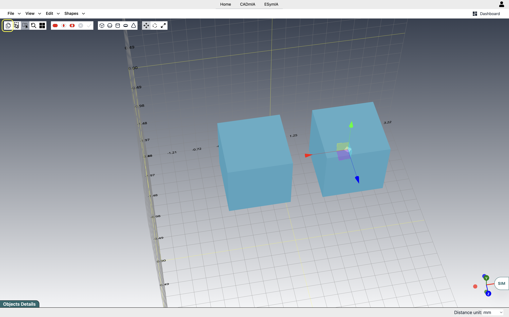
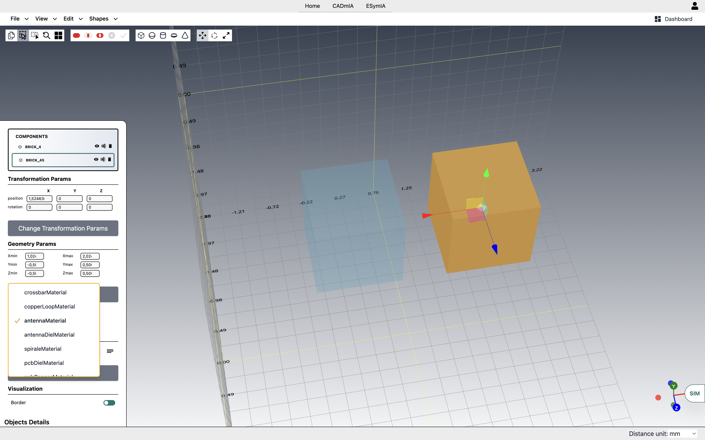
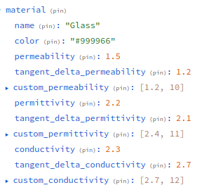

# CADmIA Docs <!-- omit in toc -->
### Versione 0.0.1 <!-- omit in toc -->
- [**Scopo**](#scopo)
- [**Panoramica dell'architettura**](#panoramica-dellarchitettura)
- [**Funzionalità**](#funzionalità)
  - [**Modelli base**](#modelli-base)
  - [**Composizione con operazioni binarie**](#composizione-con-operazioni-binarie)
  - [**Trasformazioni**](#trasformazioni)
  - [**Clonazione di oggetti**](#clonazione-di-oggetti)
  - [**Materiali**](#materiali)
  - [**Import**](#import)
  - [**Export**](#export)

## **Scopo**

CADmIA è un'applicazione per la creazione di modelli 3D.
Nata inizialmente per la modellazione in ambito elettrico/elettronico, ha acquisito poi una sua indipendenza, slegandosi da specifici domini applicativi.
Tramite una serie di componenti base (in futuro estendibili) componibili, si può arrivare a creare modelli anche di elevata complessità.

## **Panoramica dell'architettura**

## **Funzionalità**

### **Modelli base**

Allo stato attuale, sono disponibili 5 modelli di base (vedi immagine seguente), ognuno con caratteristiche specifiche regolabili dalla SideBar:
- *cubo*, con altezza, larghezza, profondità.
- *sfera*, caratterizzata dal suo raggio.
- *cilindro*, con altezza e raggi di base regolabili singolarmente. In tal modo è molto semplice ottenere ad esempio dei tronchi di cono.
- *toro*, definito da un raggio del toro che va dal centro dell'oggetto fino al centro del tubo, un raggio del tubo, che determina lo spessore della ciambella.
- *cono*, con altezza e raggio di base.

Ognuno di essi ha poi degli attributi riguardanti il numero di segmenti da utilizzare per rappresentare le varie superfici che lo compongono. Questi non riguardano le proprietà geometriche degli oggetti, ma la loro rappresentazione in ThreeJS, che li vede come Mesh, quindi composizioni di unità più piccole. Quanto più grande è il numero di segmenti impostato per le superfici di un oggetto, tanto maggiore sarà il suo livello di dettaglio, tanto più onerosa sarà la sua rappresentazione.
Sta quindi all'utente scegliere il giusto compromesso tra prestazioni e precisione richiesta.

#### *Esempio* <!-- omit in toc -->

il cilindro in ThreeJS è in realtà un prisma di cui è possibile regolare il numero di segmenti radiali. In sostanza, il profilo curvo è approssimato con delle spezzate, pertanto più è alto il numero di segmenti radiali, migliore sarà l'approssimazione del prisma verso un cilindro.

Dall'esempio si intuisce anche come, tramite questi attributi aggiuntivi, sia possibile ottenere altre forme geometriche: se infatti volessimo un prisma a base pentagonale, ci basterebbe prendere il cilindro come elemento base ed impostargli un numero di segmenti radiali pari a 5.
Allo stesso modo se volessimo una piramide a base quadrata, potremmo partire da un cono ed impostare il numero di segmenti radiali a 4.

### **Composizione con operazioni binarie**

Per la creazione di modelli complessi, i componenti base con i loro attributi regolabili da soli non sono sufficienti. Abbiamo allora aggiunto la possibilità di effettuare delle operazioni binarie tra essi, in modo da comporli assieme in oggetti di complessità arbitraria.
Nella figura seguente possiamo vedere semplici esempi di unione, intersezione e differenza.

Utilizzando la specifica toolbar posta sulla sinistra è possibile selezionare il tipo di operazione desiderata per entrare nella modalità "Binary Operation": ve ne accorgerete perché gli oggetti diverranno semitrasparenti. A questo punto potremo selezionare i singoli oggetti sui quali effettuare l'operazione (che risulteranno evidenziati rispetto agli altri) e infine avviarla dalla toolbar.   
Qualora avessimo selezionato un oggetto per sbaglio, ci basterà cliccare nuovamente su di esso per deselezionarlo.  
In qualsiasi momento, sempre dalla toolbar, è possibile annullare l'intera procedura, uscendo dalla modalità "Binary Operation".

È inoltre prevista la possibilità di effettuare una stessa operazione in cascata tra più di due oggetti la volta. Basterà selezionarli tutti prima di avviare l'operazione.

Ricordate, infine, che mentre l'unione e l'intersezione sono commutative, per cui non ha importanza l'ordine con cui selezionate gli oggetti, la differenza non lo è, pertanto prestate attenzione al giusto ordine quando selezionerete gli oggetti su cui eseguirla.

### **Trasformazioni**

Ogni volta che selezioniamo un oggetto, su di esso si attiveranno dei controlli per effettuare 3 tipi di trasformazione:
- *traslazione*, per muovere l'oggetto all'interno della scena;
- *rotazione*, per ruotare l'oggetto attorno ai suoi assi;
- *scalamento*, per ridimensionare l'oggetto, sempre lungo i suoi assi.

Nella figura possiamo vedere come si presentano i controlli nei tre casi.

Nell'immagine si nota inoltre l'apposita toolbar in alto a sinistra, che ci permette di selezionare la specifica trasformazione. In alternativa, come scorciatoia, possiamo utilizzare il click destro sull'oggetto, che passerà dall'una all'atra in sequenza.

Per un risultato più accurato, ad esempio spostamenti di precisione, è possibile impostare direttamente i valori numerici relativi alle tre trasformazioni tramite la SideBar, come si può vedere nella figura seguente.

### **Clonazione di oggetti**

Un'operazione comune, utile per risparmiare tempo, è quella di clonazione, che replica un oggetto esistente con tutte le sue proprietà. 
Per effettuare questa operazione basta selezionare l'oggetto e poi utilizzare il comando apposito che si può vedere nella figura seguente, dove l'abbiamo usato per clonare una piramide. 
Comunque, seppur identico all'originale, il nuovo oggetto creato è completamente indipendente da esso.

### **Materiali**

Oltre le caratteristiche geometriche, è possibile assegnare agli oggetti anche dei materiali. 
Nella figura seguente vediamo la selezione del materiale tramite la SideBar. Per poter utilizzare i materiali bisogna essere loggati. 

L'assegnazione di un materiale, oltre ad un riscontro immediato sull'oggetto, che assumerà il colore definito dal materiale, comporta per l'oggetto anche l'assunzione di tutte le proprietà fisiche del materiale stesso. Nella figura sottostante si possono vedere alcune proprietà specifiche che i materiali portano con sé.  
  
Al momento le proprietà fisiche di interesse sono quelle di natura elettrica/elettronica, ma in futuro potranno esserne aggiunte altre, ad esempio proprietà meccaniche.

### **Import**

### **Export**
