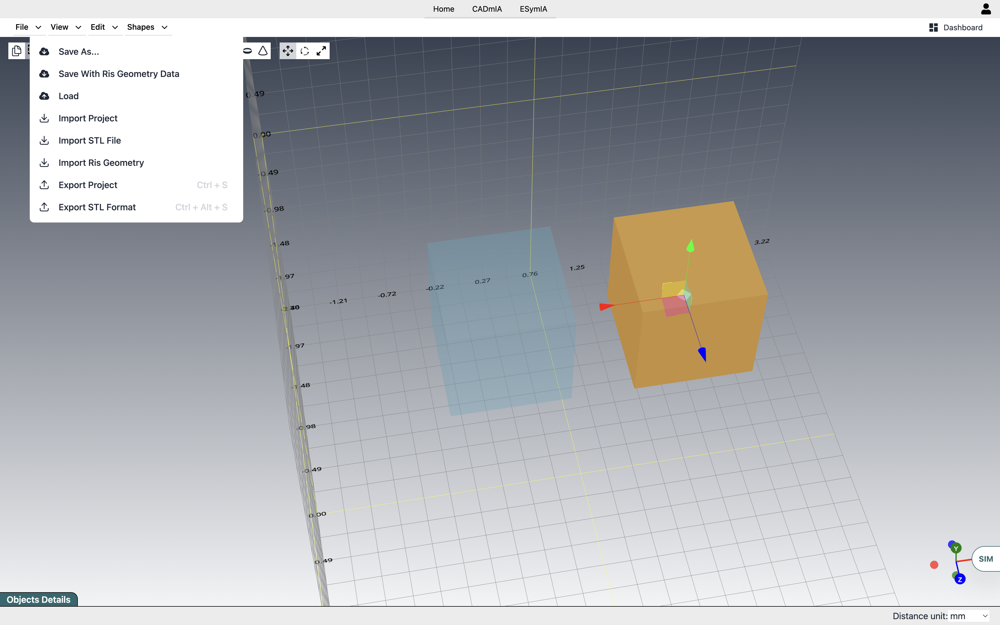

# CADmIA Docs <!-- omit in toc -->

## Versione 0.0.1 <!-- omit in toc -->

- [**Scopo**](#scopo)
- [**Funzionalità**](#funzionalità)
  - [**Muoversi nella scena**](#muoversi-nella-scena)
  - [**Modelli base**](#modelli-base)
  - [**Composizione con operazioni binarie**](#composizione-con-operazioni-binarie)
    - [**UNION**](#union)
    - [**SUBTRACTION**](#subtraction)
    - [**INTERSECTION**](#intersection)
  - [**Trasformazioni**](#trasformazioni)
  - [**Clonazione di oggetti**](#clonazione-di-oggetti)
  - [**Materiali**](#materiali)
  - [**Costruzione del modello: Standard vs Ris**](#costruzione-del-modello-standard-vs-ris)
    - [**Standard**](#standard)
    - [**Ris**](#ris)
  - [**Import/Export**](#importexport)

## **Scopo**

CADmIA è un'applicazione per la creazione di modelli 3D.
Nata inizialmente per la modellazione in ambito elettrico/elettronico, ha acquisito poi una sua indipendenza, slegandosi da specifici domini applicativi.
Tramite una serie di componenti base (in futuro estendibili) componibili, si può arrivare a creare modelli di elevata complessità.

<!-- ## **Panoramica dell'architettura**

Vediamo innanzitutto uno schema di massima dell'architettura di CADmIA, con esempi di relazioni tra i vari strati per alcune funzionalità specifiche.

L'applicazione è basata su due tecnologie prinicipali lato client:
- *ReactJS*, per lo sviluppo dell'interfaccia;
- *ThreeJS*, per la rappresentazione dei modelli 3D.

Per quanto riguarda la parte server, invece, ne sfrutta essenzialmente tre:
- *Auth0*, per le procedure di autenticazione e gestione degli utenti;
- *Fauna*, per la gestione dei dati dell'app, con le relative politiche di accesso ad essi da parte degli utenti;
- *AWS*, utilizzato come storage per i modelli salvati, che possono arrivare a dimensioni considerevoli, non gestibili direttamente tramite Fauna.  -->

## **Funzionalità**

La parte principale dell'interfaccia è rappresentata dal Canvas, lo spazio nel quale verranno creati i modelli.

### **Muoversi nella scena**

Una delle sue principali funzionalità è la possibilità di ruotare la scena, cambiando l'angolo di visuale. Per far questo basta cliccare in un punto vuoto della scena e, tenendo premuto, muoversi ruotando la visuale. 
Un'altra funzione molto utile è quella di zoom, attivabile tramite le analoghe procedure di touchpad e mouse. 
Una cosa da tenere presente è che il punto di vista è centrato di default sull'origine degli assi di riferimento, per cui sia la rotazione della scena che lo zoom saranno realizzati rispetto a quel punto specifico. In alcuni casi però vorremo poter vedere nel dettaglio uno specifico oggetto: in questo caso prima di effettuare zoom o rotazioni di scena, possiamo centrare il punto di vista sull'oggetto specifico, con un doppio click su di esso. Sarà sempre possibile reimpostare il punto di vista di default sull'origine degli assi, tramite il menu *View->Reset Orbit To Origin*.

### **Modelli base**

Allo stato attuale, sono disponibili 5 modelli di base (vedi immagine seguente), ognuno con caratteristiche specifiche regolabili dalla SideBar:

- *cubo*, con altezza, larghezza, profondità.
- *sfera*, caratterizzata dal suo raggio.
- *cilindro*, con altezza e raggi di base regolabili singolarmente. In tal modo è molto semplice ottenere ad esempio dei tronchi di cono.
- *toro*, definito da un raggio del toro che va dal centro dell'oggetto fino al centro del tubo, un raggio del tubo, che determina lo spessore della ciambella.
- *cono*, con altezza e raggio di base.

È possibile inserirli nella scena sia tramite l'apposita voce di menu nell navbar che tramite una comoda toolbar (evidenziata in giallo nell'immagine).

Ognuno dei modelli ha poi degli attributi riguardanti il numero di segmenti da utilizzare per rappresentare le varie superfici che lo compongono. Questi non riguardano le proprietà geometriche degli oggetti, ma la loro rappresentazione in ThreeJS, che li vede come Mesh, quindi composizioni di unità più piccole. Quanto più grande è il numero di segmenti impostato per le superfici di un oggetto, tanto maggiore sarà il suo livello di dettaglio, tanto più onerosa sarà la sua rappresentazione.
Sta quindi all'utente scegliere il giusto compromesso tra prestazioni e precisione richiesta.
___

#### *Esempio* <!-- omit in toc -->

il cilindro in ThreeJS è in realtà un prisma di cui è possibile regolare il numero di segmenti radiali. In sostanza, il profilo curvo è approssimato con delle spezzate, pertanto più è alto il numero di segmenti radiali, migliore sarà l'approssimazione del prisma verso un cilindro.
___

Dall'esempio si intuisce anche come, tramite questi attributi aggiuntivi, sia possibile ottenere altre forme geometriche: se infatti volessimo un prisma a base pentagonale, ci basterebbe prendere il cilindro come elemento base ed impostargli un numero di segmenti radiali pari a 5.
Allo stesso modo se volessimo una piramide a base quadrata, potremmo partire da un cono ed impostare il numero di segmenti radiali a 4.

### **Composizione con operazioni binarie**

Per la creazione di modelli complessi, i componenti base con i loro attributi regolabili da soli non sono sufficienti. Abbiamo allora aggiunto la possibilità di effettuare delle operazioni binarie tra essi, in modo da comporli assieme in oggetti di complessità arbitraria.
Nei seguenti video possiamo vedere semplici esempi di unione, intersezione e differenza.

#### **UNION**

#### **SUBTRACTION**

#### **INTERSECTION**

Utilizzando la specifica toolbar posta sulla sinistra è possibile selezionare il tipo di operazione desiderata per entrare nella modalità "Binary Operation": ve ne accorgerete perché gli oggetti diverranno semitrasparenti. A questo punto potremo selezionare i singoli oggetti sui quali effettuare l'operazione (che risulteranno evidenziati rispetto agli altri) e infine avviarla dalla toolbar.  
Qualora avessimo selezionato un oggetto per sbaglio, ci basterà cliccare nuovamente su di esso per deselezionarlo. 
In qualsiasi momento, sempre dalla toolbar, è possibile annullare l'intera procedura, uscendo dalla modalità "Binary Operation".

È inoltre prevista la possibilità di effettuare una stessa operazione in cascata tra più di due oggetti la volta. Basterà selezionarli tutti prima di avviare l'operazione.

Ricordate, infine, che mentre l'unione e l'intersezione sono commutative, per cui non ha importanza l'ordine con cui selezionate gli oggetti, la differenza non lo è, pertanto prestate attenzione al giusto ordine quando selezionerete gli oggetti su cui eseguirla.

### **Trasformazioni**

Ogni volta che selezioniamo un oggetto, su di esso si attiveranno dei controlli per effettuare 3 tipi di trasformazione:

- *traslazione*, per muovere l'oggetto all'interno della scena;
- *rotazione*, per ruotare l'oggetto attorno ai suoi assi;
- *scalamento*, per ridimensionare l'oggetto, sempre lungo i suoi assi.

Nella figura possiamo vedere come si presentano i controlli nei tre casi.

Per selezionare la specifica trasformazione è necessario attivare l'apposita toolbar tramite la voce di menù *View->Trasformations toolbar*.

Per un risultato più accurato, ad esempio spostamenti di precisione, è possibile impostare direttamente i valori numerici relativi alle tre trasformazioni tramite la i campi di input presenti nella modale attivabile grazie al pulsante *Change Transformation Params*, come si può vedere nella figura seguente.

### **Clonazione di oggetti**

Un'operazione comune, utile per risparmiare tempo, è quella di clonazione, che replica un oggetto esistente con tutte le sue proprietà. 
Per effettuare questa operazione basta selezionare l'oggetto e poi utilizzare il comando apposito che si può vedere nella figura seguente, evidenziato in giallo, dove l'abbiamo usato per clonare un cubo. 
Comunque, seppur identico all'originale, il nuovo oggetto creato è completamente indipendente da esso.

### **Materiali**

Oltre le caratteristiche geometriche, è possibile assegnare agli oggetti anche dei materiali. 
Nella figura seguente vediamo la selezione del materiale tramite la SideBar. Per poter utilizzare i materiali bisogna essere loggati.

L'assegnazione di un materiale, oltre ad un riscontro immediato sull'oggetto, che assumerà il colore definito da quello, comporta per l'oggetto anche l'assunzione di tutte le proprietà fisiche del materiale stesso. Nella figura sottostante si possono vedere alcune proprietà specifiche che i materiali portano con sé, nel riquadro evidenziato in giallo.

Al momento le proprietà fisiche di interesse sono quelle di natura elettrica/elettronica, ma in futuro potranno esserne aggiunte altre, ad esempio proprietà meccaniche.

### **Costruzione del modello: Standard vs Ris**

Un modello può essere definito tramite due strategie operative:

- Standar
- Ris

#### **Standard**

Questa prevede la costruzione del modello tramite l'import di file STL, oppure sfruttando le forme di base messe a disposizione, applicando su di esse operazioni booleane.
Nel seguente video verrà mostrato un esempio di costruzione del modello secondo la strategia Standard.

#### **Ris**

In questo caso la costruzione del modello avviene attraverso la definizione di una serie di bricks (cubi).
Nel seguente video verrà mostrato un esempio di costruzione del modello secondo la strategia Ris.

È fondamentale distinguere tra le diverse strategie, poiché la scelta adottata influirà sulla simulazione futura del modello. In particolare, durante la fase preliminare della simulazione, che prevede la suddivisione del modello in una serie di elementi semplici (nel nostro caso, parallelepipedi), se il modello è stato generato utilizzando la strategia *Standar*, verranno restituiti elementi di dimensioni uniformi; al contrario, adottando la strategia *Ris*, si otterranno elementi di dimensioni variabili.

### **Import/Export**

Per quanto riguarda le funzionalità di import/export, abbiamo tre opzioni disponibili al momento. Nella figura possiamo vedere il menu relativo.

In particolare abbiamo:

- Export
  - *Save As*. Salva il modello, costruito attraverso la strategia Standard, sul server e richiede il login.  Selezionando l'apposita voce di menù ci verrà chiesto di inserire un nome per il modello da salvare. Nel modello saranno compresi tutti gli oggetti presenti nella scena.
  - *Save With Ris Geometry Data*. Salva il modello, costruito attraverso la strategia Ris, sul server e richiede il login.  Selezionando l'apposita voce di menù ci verrà chiesto di inserire un nome per il modello da salvare. Nel modello saranno compresi tutti gli oggetti presenti nella scena.
  - *Export Project*. Tramite essa andremo ad esportare in locale, in formato JSON, tutti gli oggetti presenti nella scena.
  - *Export STL Format*. In questo caso esportiamo in locale gli oggetti presenti nella scena, ma in formato STL, uno standard molto diffuso.  Una differenza importante rispetto all'export in JSON è che, in questo caso, per vincoli di formato, tutti gli oggetti della scena verranno esportati come fossero un tutt'uno. Se ad esempio nella scena avessimo due oggetti distinti, essi verrebbero esportati come un'unica geometria, per cui un futuro import non ci permetterebbe di riavere gli oggetti distinti, ma solo la loro unione.  Perderemo, inoltre, le informazioni sui materiali assegnati ai vari oggetti.
- Import
  - *Load*. Consente di riprendere un modello salvato sul server e richiede il login.  Tramite questa voce di menu ci si aprirà una finestra con una lista dei modelli precedentemente salvati da noi sul database, per poterne selezionare uno da caricare nella scena.
  - *Import Project*. Questa opzione consente di caricare nella scena un modello Standar salvato precedentemente in formato JSON.
  - *Import STL File*. In questo caso andiamo a caricare il modello da un file STL locale.
  - *Import Ris Geometry*. In questo caso andiamo a caricare il modello Ris salvato precedentemente in formato JSON.
