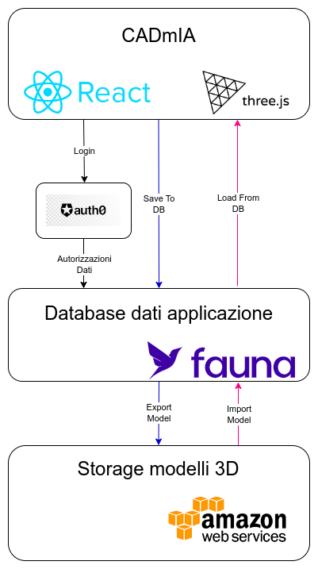
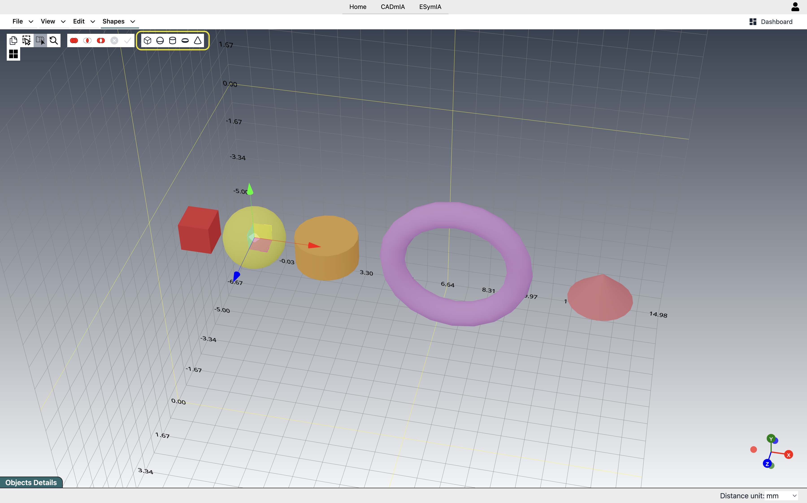
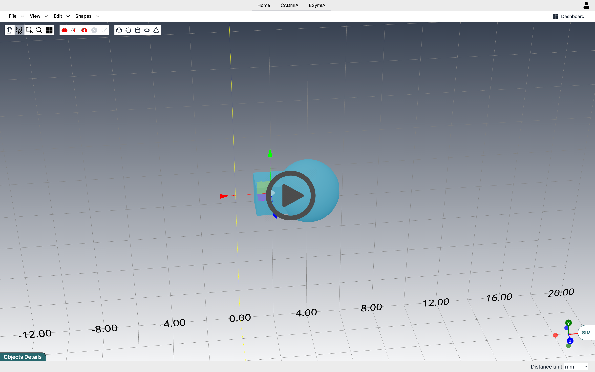
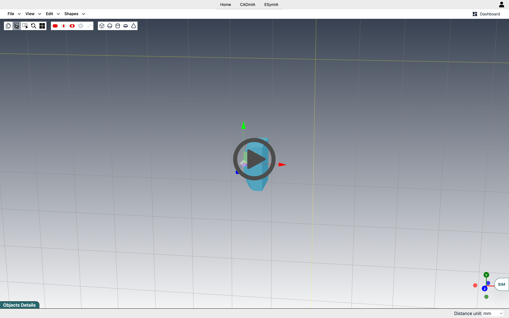
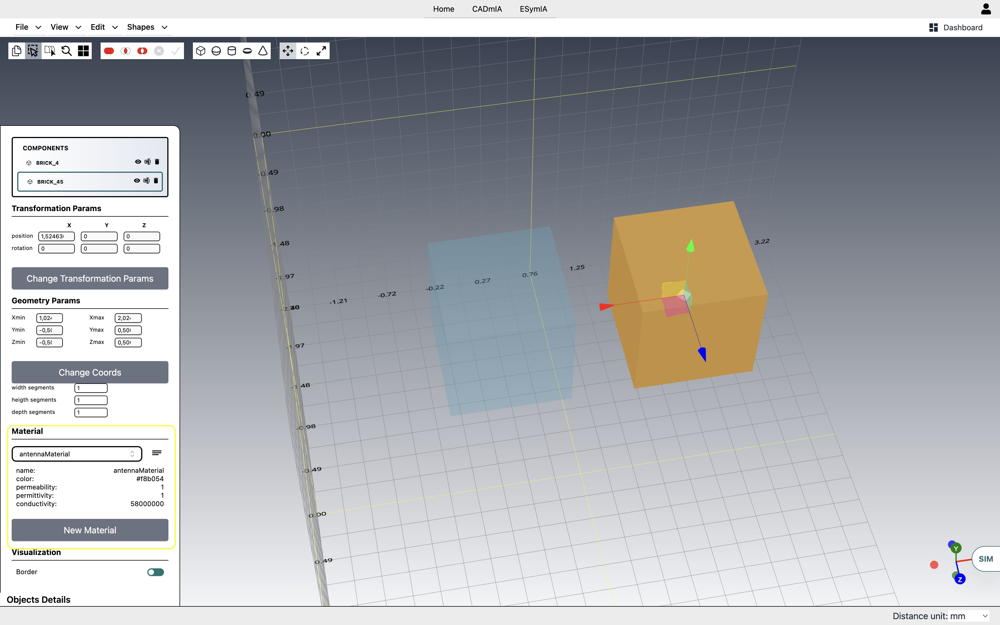

# CADmIA Docs <!-- omit in toc -->

## Version 0.0.1 <!-- omit in toc -->

- [**Purpose**](#purpose)
- [**Features**](#features)
  - [**Navigating the Scene**](#navigating-the-scene)
  - [**Basic Models**](#basic-models)
  - [**Composition with Binary Operations**](#composition-with-binary-operations)
    - [**UNION**](#union)
    - [**SUBTRACTION**](#subtraction)
    - [**INTERSECTION**](#intersection)
  - [**Transformations**](#transformations)
  - [**Object Cloning**](#object-cloning)
  - [**Materials**](#materials)
  - [**Model Construction: Standard vs Ris**](#model-construction-standard-vs-ris)
    - [**Standard**](#standard)
    - [**Ris**](#ris)
  - [**Import/Export**](#importexport)

## **Purpose**

CADmIA is an application for creating 3D models.
Initially born for modeling in the electrical/electronic field, it later became independent, detaching itself from specific application domains.
Through a series of basic (and in the future, extendable) components, which can be combined, you can create highly complex models.

<!-- ## **Architecture Overview**

Let's first take a high-level look at the architecture of CADmIA, with examples of relationships between the various layers for some specific features.

The application is based on two main client-side technologies:
- *ReactJS*, for developing the interface;
- *ThreeJS*, for rendering 3D models.

As for the server side, it essentially relies on three services:
- *Auth0*, for authentication and user management procedures;
- *Fauna*, for managing app data, with the relevant user access policies;
- *AWS*, used as storage for saved models, which can reach considerable sizes not manageable directly via Fauna.  -->

## **Features**

The main part of the interface is the Canvas, the space where models will be created.

### **Navigating the Scene**

One of its main features is the ability to rotate the scene, changing the viewing angle. To do this, simply click on an empty spot in the scene and, while holding down, move the mouse or finger in the desired direction.
Another very useful function is zoom, which can be activated via the usual touchpad and mouse gestures. 
One thing to keep in mind is that the point of view is by default centered on the origin of the reference axes, so both scene rotation and zoom will be performed with respect to that point.

### **Basic Models**

Currently, 5 basic models are available (see the image below), each with specific characteristics adjustable from the SideBar:

- *cube*, with height, width, and depth.
- *sphere*, defined by its radius.
- *cylinder*, with adjustable height and base radii. This makes it very easy, for example, to create truncated cones.
- *torus*, defined by a torus radius (from the center of the object to the center of the tube) and a tube radius (which determines the thickness of the donut).
- *cone*, with height and base radius.

You can insert them into the scene either via the appropriate menu item in the navbar or through a handy toolbar (highlighted in yellow in the image).

Each model also has attributes related to the number of segments to use for representing the various surfaces that compose it. These do not affect the geometric properties of the object but only its visual rendering.
It is up to the user to choose the right compromise between performance and required precision.
___

#### *Example* <!-- omit in toc -->

The cylinder in ThreeJS is actually a prism whose number of radial segments can be adjusted. Essentially, the curved profile is approximated with polylines, so the higher the number of segments, the more the object will resemble a real cylinder, but at the cost of performance.
___

From the example, it is also clear how, through these additional attributes, it is possible to obtain other geometric shapes: if we wanted a pentagonal prism, we would simply take the cylinder and set the number of radial segments to 5.
Similarly, if we wanted a square-based pyramid, we could start from a cone and set the number of radial segments to 4.

### **Composition with Binary Operations**

For creating complex models, the basic components with their adjustable attributes alone are not enough. Therefore, we have added the ability to perform binary operations between objects.
The following videos show simple examples of union, intersection, and difference.

#### **UNION**

#### **SUBTRACTION**

#### **INTERSECTION**

Using the specific toolbar on the left, you can select the type of operation you want to enter "Binary Operation" mode: you will notice this because the objects in the scene will be highlighted.
If you selected an object by mistake, just click on it again to deselect it. 
At any time, again from the toolbar, you can cancel the entire procedure, exiting "Binary Operation" mode.

It is also possible to perform the same operation in cascade between more than two objects at a time. Just select them all before starting the operation.

Remember that while union and intersection are commutative (order does not matter), subtraction is not, so pay attention to the order in which you select objects.

### **Transformations**

Whenever we select an object, controls are activated to perform 3 types of transformation:

- *translation*, to move the object within the scene;
- *rotation*, to rotate the object around its axes;
- *scaling*, to resize the object along its axes.

The figure shows how the controls appear in the three cases.

To select the specific transformation, you need to activate the appropriate toolbar via the *View->Transformations toolbar* menu item.

For a more accurate result, such as precise movements, you can directly set the numerical values for the three transformations via the input fields in the SideBar.

### **Object Cloning**

A common operation, useful for saving time, is cloning, which replicates an existing object with all its properties. 
To perform this operation, simply select the object and then use the appropriate command, highlighted in yellow in the figure below, where we used it to clone a cylinder.
Even though it is identical to the original, the newly created object is completely independent from it.

### **Materials**

In addition to geometric characteristics, you can also assign materials to objects. 
The figure below shows material selection via the SideBar. To use materials, you must be logged in.

Assigning a material, in addition to giving immediate visual feedback (the object will take on the material's defined color), also gives the object all the physical properties of the material.

Currently, the relevant physical properties are electrical/electronic, but more may be added in the future, such as mechanical properties.

### **Model Construction: Standard vs Ris**

A model can be defined using two operational strategies:

- Standard
- Ris

#### **Standard**

This involves building the model by importing STL files or using the available basic shapes, applying boolean operations to them.
The following video shows an example of model construction using the Standard strategy.

#### **Ris**

In this case, the model is built by defining a series of bricks (cubes).
The following video shows an example of model construction using the Ris strategy.

It is essential to distinguish between the different strategies, as the chosen one will affect the future simulation of the model. In particular, during the preliminary simulation phase, which involves checking the geometry for possible errors, the procedure will differ based on the adopted strategy.

### **Import/Export**

As for import/export features, we currently have three available options. The figure below shows the related menu.

In particular, we have:

- Export
  - *Save As*. Saves the model, built using the Standard strategy, on the server and requires login.  When selecting this menu item, you will be asked to enter a name for the model, and it will be saved on the server.
  - *Save With Ris Geometry Data*. Saves the model, built using the Ris strategy, on the server and requires login.  When selecting this menu item, you will be asked to enter a name for the model, and it will be saved on the server.
  - *Export Project*. Exports all objects present in the scene locally in JSON format.
  - *Export STL Format*. Exports the objects present in the scene locally in STL format, a widely used standard.  An important difference compared to JSON export is that STL only saves the geometric properties, not the materials or other attributes.
- Import
  - *Load*. Allows you to resume a model saved on the server and requires login.  This menu item opens a window with a list of models previously saved by the user on the server.
  - *Import Project*. Allows you to load into the scene a Standard model previously saved in JSON format.
  - *Import STL File*. Loads the model from a local STL file.
  - *Import Ris Geometry*. Loads a Ris model previously saved in JSON format.
