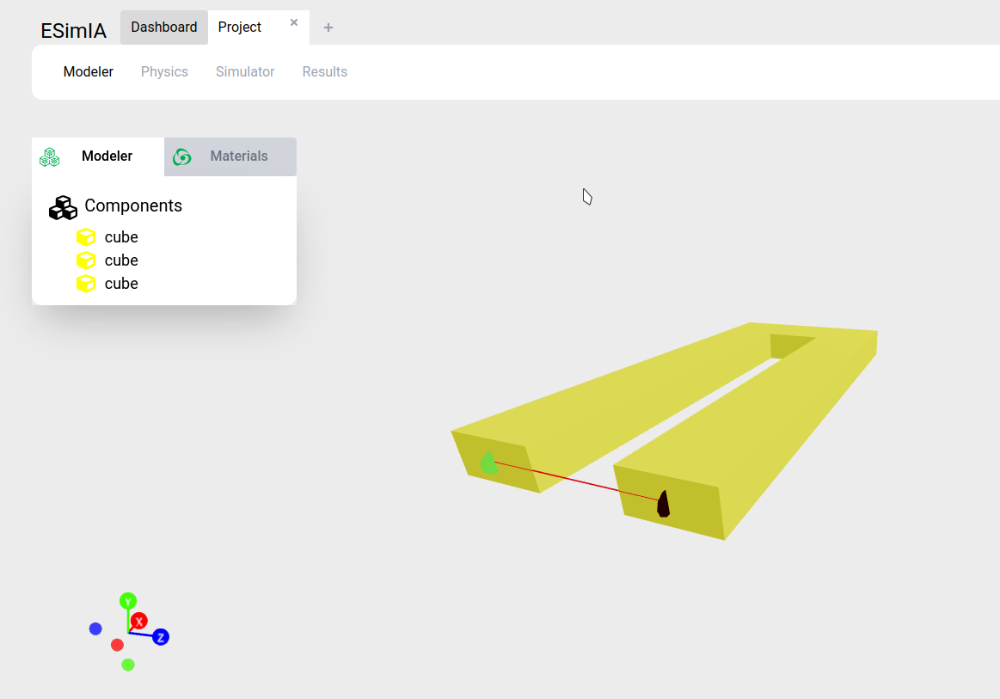
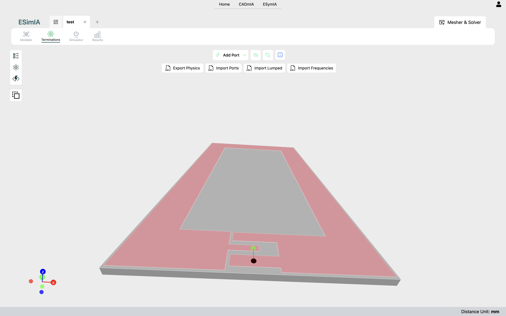
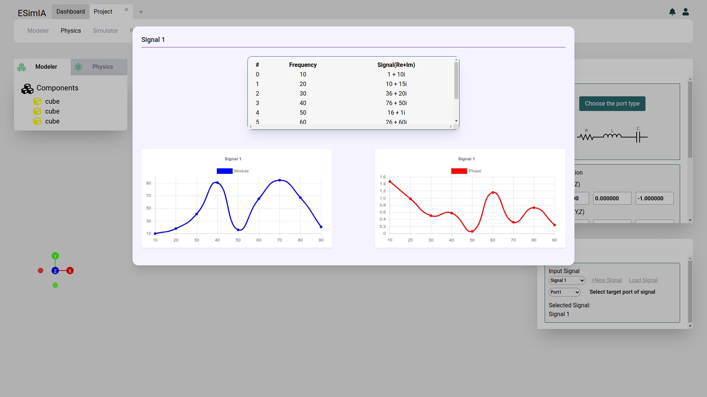
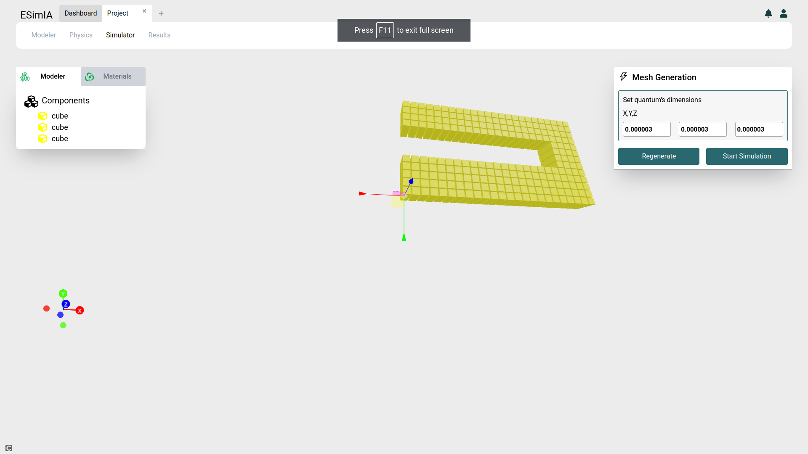
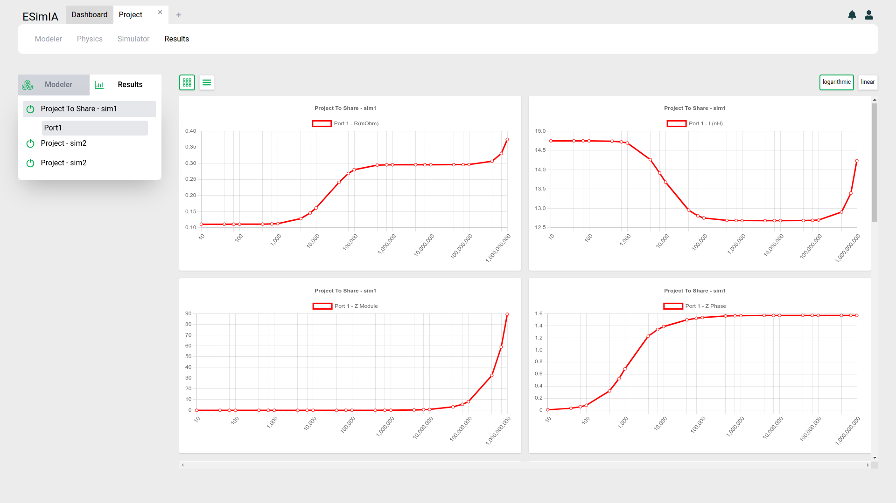
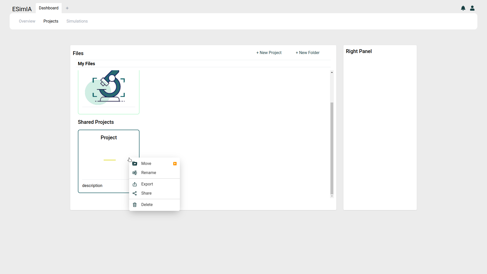

# ESymIA Docs <!-- omit in toc -->

- [Scopo](#scopo)
- [Panoramica dell'architettura](#panoramica-dellarchitettura)
- [Funzionalità](#funzionalità)
  - [Progetti di simulazione](#progetti-di-simulazione)
    - [Modeler](#modeler)
    - [Physics](#physics)
      - [Porte](#porte)
      - [Segnali](#segnali)
    - [Simulator](#simulator)
      - [Meshing](#meshing)
    - [Results](#results)
  - [Storage utente](#storage-utente)
    - [Condivisione progetti e cartelle](#condivisione-progetti-e-cartelle)

## Scopo
ESymIA è un'applicazione per la simulazione delle caratteristiche elettriche/elettroniche di modelli 3D.

## Panoramica dell'architettura

## Funzionalità

### Progetti di simulazione

#### Modeler

#### Physics

##### Porte

##### Segnali

#### Simulator

##### Meshing

#### Results

### Storage utente

#### Condivisione progetti e cartelle
