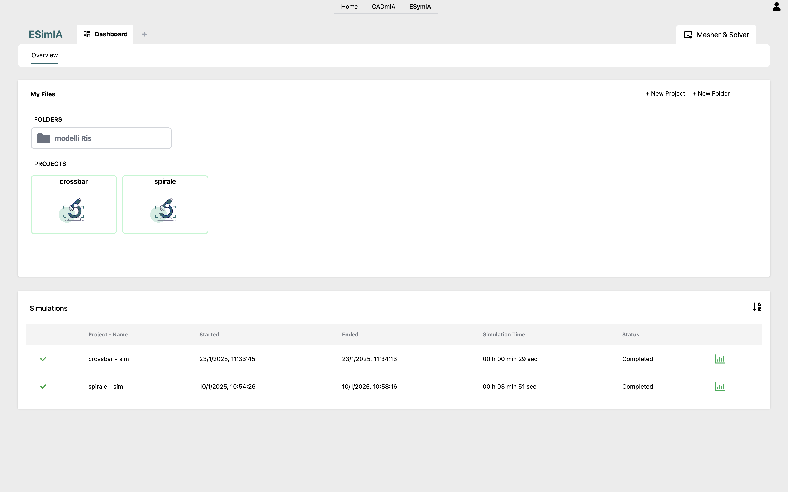
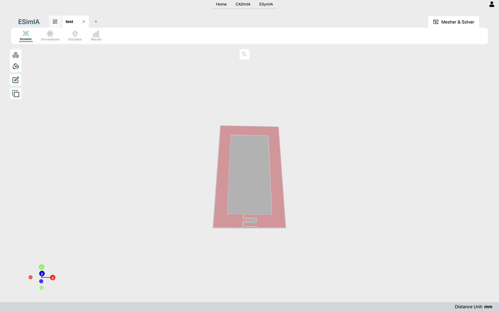
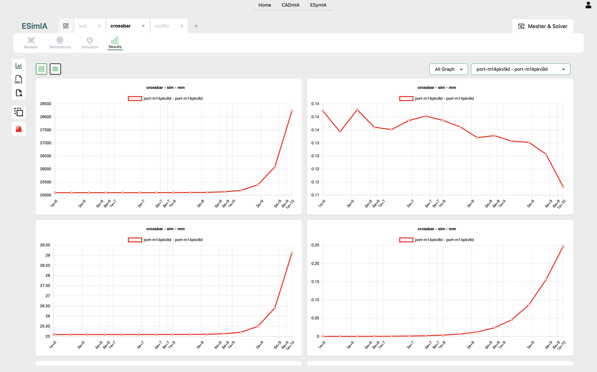

# ESymIA Docs <!-- omit in toc -->
### Versione 0.0.1 <!-- omit in toc -->
- [**Scopo**](#scopo)
- [**Panoramica dell'architettura**](#panoramica-dellarchitettura)
- [**Funzionalità**](#funzionalità)
  - [**Progetti di simulazione**](#progetti-di-simulazione)
    - [**Modeler**](#modeler)
    - [**Physics**](#physics)
      - [**Porte**](#porte)
      - [**Segnali**](#segnali)
    - [**Simulator**](#simulator)
    - [**Results**](#results)
  - [**Storage utente**](#storage-utente)
    - [**Condivisione progetti e cartelle**](#condivisione-progetti-e-cartelle)

## **Scopo**
ESymIA è un'applicazione per la simulazione delle caratteristiche elettriche/elettroniche di modelli 3D, basandosi su metodologie FEM.

## **Panoramica dell'architettura**

Vediamo innanzitutto uno schema di massima dell'architettura di CADmIA, con esempi di relazioni tra i vari strati per alcune funzionalità specifiche. 
 
L'applicazione è basata su due tecnologie prinicipali lato client:
- *ReactJS*, per lo sviluppo dell'interfaccia;
- *ThreeJS*, per la rappresentazione dei modelli 3D.

Per quanto riguarda la parte server, invece, ne sfrutta essenzialmente tre:
- *Auth0*, per le procedure di autenticazione e gestione degli utenti;
- *Fauna*, per la gestione dei dati dell'app, con le relative politiche di accesso ad essi da parte degli utenti;
- *AWS*, utilizzato come storage per i modelli salvati, che possono arrivare a dimensioni considerevoli, non gestibili direttamente tramite Fauna. 

## **Funzionalità**

ESymIA è tutta incentrata sulla simulazione delle caratteristiche elettriche/elettroniche di modelli 3D. Tutte le sue funzionalità ruotano essenzialmente attorno a questo.
In particolare il flusso di esecuzione di una simulazione si sviluppa in 4 step consecutivi:
- *Modeler*, dove andiamo ad importare il modello da testare;
- *Physics*, nel quale aggiungiamo al modello le informazioni necessarie alla simulazione;
- *Simulator*, nel quale andiamo ad eseguire l'operazione di meshing.
- *Results*, dove visualizzeremo i risultati dei calcoli di simulazione.

Torneremo in dettaglio su ognuno di essi nelle prossime sezioni.

### **Progetti di simulazione**

Il processo di simulazione è interamente racchiuso all'interno di un progetto. Per cui la prima cosa da fare un volta autenticati, sarà quella di aprirne uno. 
Per far questo, a partire dalla dashboard (vedi la figura sottostante), abbiamo tre opzioni disponibili:
- creare un nuovo progetto tramite la voce *New Project*: ci verrà chiesto di inserire un nome per esso, oltre ad una descrizione opzionale;
- proseguire con un progetto salvato in locale, importandolo tramite *Import Project*;
- proseguire con un progetto esistente tra quelli salvati sul database, che possiamo vedere in parte listati nella sezione *My Recent Projects*, oppure in forma completa nella scheda *Projects* del menu principale della dashboard.
- 

Sempre nella dashboard, inoltre, si ha a disposizione una lista delle ultime simulazioni effettuate, dalla quale è possibile andare a visualizzarne direttamente i risultati.
Per una lista completa delle simulazioni effettuate, si può invece far riferimento alla voce *Simulations* del menu principale della dashboard.

#### **Modeler**

Una volta aperto un progetto, ci ritroveremo automaticamente nella sezione *Modeler*, dalla quale potremo importare, tramite due pulsanti appositi, un modello dal database o da file locale.

Il risultato è visibile nella figura seguente.

In questa sezione possiamo vedere dettagli del modello, ovvero i vari elementi che costiruiscono la sua struttura interna, con informazioni sui relativi materiali. 
Le informazioni sono a puro scopo documentativo, da ESymIA non è possibile modificare i modelli importati. 
A questo punto possiamo proseguire nella procedura di simulazione con la sezione successiva.

#### **Physics**

Una simulazione consiste in sostanza nell'applicazione di correnti o differenze di potenziale in determinati punti del modello e la loro lettura in uscita in altri punti prestabiliti. Dal confronto tra input e output vengono determinate specifiche caratteristiche del modello. 
In questa sezione entriamo nel vivo della simulazione, andando proprio ad impostarne le informazioni di input, definite tramite *porte* e *segnali*.

##### **Porte**

Le porte, costituite visivamente da coppie di elementi congiunti da una linea, definiscono innanzitutto i punti di applicazione e lettura per le correnti o differenze di potenziale in input alla simulazione. 
Nella figura sottostante possiamo vederne una di esempio. Oltre alle informazioni sulle posizioni di applicazione e lettura, le porte mantengono anche informazioni specifiche sulle loro caratteristiche interne, rappresentate da un circuito associato e da una tupla di parametri RLC.
Tutte queste informazioni si possono impostare tramite il comodo menu in alto a destra nella sezione.

Nell'immagine vediamo anche un menu centrale, dal quale è possibile selezionare le nostre porte tra tre differenti categorie, ognuna con vincoli interni leggermente differenti, a seconda della specifica simulazione da eseguire.

##### **Segnali**

I segnali altro non sono che la rappresentazione matematica delle correnti o differenze di potenziale da applicare in input al modello. 
Vengono assegnati tramite il menu in basso a destra della sezione (vedi figura seguente), tramite il quale è possibile assegnare uno specifico segnale ad ogni singola porta. In particolare, per impostare i segnali abbiamo tre possibilità:
- importarne uno da file locale;
- selezionarne uno, tra quelli predefiniti, a disposizion sul database;
- crearne uno da zero, definendo una sequenza di coppie <frequenza, valore complesso del segnale>.

Come si vede dalla figura, per ogni segnale impostato, possiamo poi visualizzarne i dettagli (valori numerici e rappresentazioni grafiche).

#### **Simulator**

Una volta impostate porte e relativi segnali, possiamo passare alla sezione *Simulator*, nella quale andremo ad eseguire l'operazione di meshing, ovvero una scomposizione del modello in elementi semplici (parallelepipedi nel nostro caso) più piccoli. I calcoli verranno poi eseguiti in parallelo sui singoli elementi e il risultato finale della simulazione sarà dato da una composizione di tutti i risultati parziali. 
In questa sezione l'unica cosa che dobbiamo impostare sono le dimensioni desiderate per il parallelepipedo campione da usare nella scomposizione. Lo facciamo tramite il comodo menu visibile in figura.

Nella figura vediamo il risultato del meshing, con il nostro modello scomposto. A questo punto, se il risultato è soddisfacente, possiamo proseguire avviando la simulazione vera e propria, altrimenti possiamo modificare le dimensioni del parallelepipedo campione e rieseguire l'operazione di meshing, fino ad ottenere un risultato accettabile. 
La procedura si conclude poi, in ogni caso, con l'avvio della simulazione tramite il pulsante *Start Simulation*.

#### **NOTA** <!-- omit in toc -->
Al termine dell'operazione di meshing le dimensioni impostate per il parallelepipedo campione potrebbero venire modificate leggermente rispetto a quelle impostate: questo perché, dovendo scomporre il modello in elementi che siano "interi", è necessario aggiustare le dimensioni del parallelepipedo a valori sottomultipli delle dimensioni del modello.

#### **Results**

Una volta avviata, la simulazione lavorerà in background, per cui nell'attesa potremo anche fare altro. 
Una volta terminata, potremo andare nella sezione *Results* del progetto relativo, per analizzarne i risultati, sottoforma di grafici sulle varie proprietà oggetto di interesse. 
Nell'immagine possiamo vedere una schermata d'esempio di possibili risultati.

Tramite i pulsanti posti nella fascia al di sopra dei grafici è possibile regolare alcune impostazioni di visualizzazione, come la visita su una colonna (grafici più grandi) o su due (più compatta), oltre alla scala delle ascisse dei grafici (lineare o logaritmica).

### **Storage utente**

#### **Condivisione progetti e cartelle**
