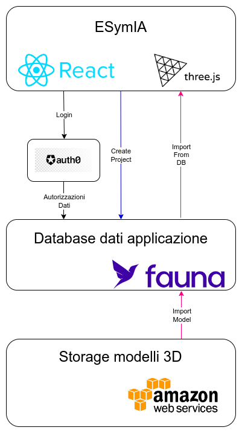

# ESymIA Docs <!-- omit in toc -->

## Version 0.0.1 <!-- omit in toc -->

<!-- - [**Architecture Overview**](#architecture-overview) -->
- [**Purpose**](#purpose)
- [**Features**](#features)
  - [**Simulation Projects**](#simulation-projects)
    - [**Modeler**](#modeler)
    - [**Terminations**](#terminations)
      - [**Ports**](#ports)
      - [**Frequencies**](#frequencies)
    - [**Simulator**](#simulator)
    - [**Results**](#results)
  - [**User Storage**](#user-storage)
    - [**Project and Folder Sharing**](#project-and-folder-sharing)

## **Purpose**

ESymIA is an application for simulating the electrical/electronic characteristics of 3D models, based on FEM methodologies.

<!-- ## **Architecture Overview**

Let's first look at a high-level diagram of the CADmIA architecture, with examples of relationships between the various layers for some specific functionalities. 
 
The application is based on two main client-side technologies:

- *ReactJS*, for interface development;
- *ThreeJS*, for rendering 3D models.

On the server side, it essentially uses three:

- *Auth0*, for authentication and user management;
- *Fauna*, for app data management, with related user access policies;
- *AWS*, used as storage for 3D models to import, which can be quite large and not manageable directly through Fauna.  -->

## **Features**

ESymIA is entirely focused on simulating the electrical/electronic characteristics of 3D models. All its features essentially revolve around this.
Specifically, the execution flow of a simulation unfolds in 4 consecutive steps:

- *Modeler*, where the model to be tested is imported;
- *Physics*, where the necessary information for the simulation is added to the model;
- *Simulator*, where the meshing operation is performed;
- *Results*, where the simulation calculation results are displayed.

We will return in detail to each of these in the next sections.

### **Simulation Projects**

The simulation process is entirely enclosed within a project. So the first thing to do once authenticated is to open one. 
To do this, from the dashboard (see the figure below), there are two available options:

- create a new project using the *New Project* option: you will be asked to enter a name for it, along with an optional description;
- continue with an existing project saved in the database, which can be viewed in the *My Files* section.

Also in the dashboard, you have the list of simulations performed, from which you can directly view their results.

#### **Modeler**

Once a project is open, you will automatically find yourself in the *Modeler* section, where you can import a model from the database or from a local file using two dedicated buttons.

The result is shown in the following figure.

In this section, using the icons at the top left, you can view details of the model, namely the various elements that make up its internal structure, and information about their respective properties. These details are for documentation purposes only; ESymIA does not allow modification of imported models. 
Once the model is imported, you can change it using the appropriate icon if necessary. 
There is also a feature to clone the entire project (available in all sections: **Modeler**, **Terminations**, **Simulator**, **Results**). 
At this point, you can proceed to the next step of the simulation process.

#### **Terminations**

A simulation essentially consists of applying currents or potential differences at certain points of the model and reading them at other predetermined points. By comparing the input and output, the characteristics of the model are determined. 
In this section, we get to the heart of the simulation, setting the input information, defined through *ports*, *lumped* elements, and *frequencies*.

##### **Ports**

Ports, visually represented by pairs of elements joined by a line, define the points of application and reading for the currents or potential differences input into the simulation. 
The figure below shows an example. In addition to information on application and reading positions, ports also have a Scattering parameter.
Lumped elements, on the other hand, hold specific information about their internal characteristics, represented by an associated circuit and an RLC parameter tuple.
These details can be set using the icons at the top left of the section. 
For placing ports on the model, there are 4 alternatives:

- Double-click on a point of interest on the model's surface.
- Enable termination position suggestions by clicking the dedicated icon, then double-click on one of the proposed suggestions.
- Use the input fields in the Termination Settings section.
- Move the controls shown directly on the selected port (not recommended).

___

##### **NOTE** <!-- omit in toc -->

Remember to save any updates to the port settings using the *SAVE* button, otherwise changes will not be applied.
___

The image also shows a central menu, from which you can, from left to right:

- add ports, choosing between two different categories (ports and lumped), each with slightly different internal constraints depending on the specific simulation;
- enable port position suggestions;
- reset the camera focus in the canvas;
- show information about port positions;
- export the set simulation parameters (ports, lumped, and frequencies);
- import ports from a file;
- import lumped elements from a file;
- import frequencies from a file.

##### **Frequencies**

Frequencies are simply the mathematical representation of the currents or potential differences to be applied as input to the model. 
They can be defined in the frequencies section as a range of values spaced logarithmically or linearly, or imported from a file.

#### **Simulator**

Once ports and frequencies are set, you can move to the *Simulator* section, where you perform the meshing operation, i.e., breaking down the model into simple elements (parts). 
Calculations will then be performed in parallel on the individual elements, and the final simulation result will be a combination of all partial results. 
The application provides two types of *Mesher*:

- one that returns a decomposition of the model into simple elements all of the same size (*Mesher 1*);
- one that returns a decomposition into elements of different sizes (*Mesher 2*).

This is because two types of solvers are available:

- Solver *PEEC-FFT*
- Solver *PEEC-Dense*

which require two different inputs. 
The *PEEC-FFT* solver requires a mesh made up of elements of the same size, while the *PEEC-Dense* solver requires a mesh of elements of different sizes. 
At this point, it is important to clarify: the use of the two meshers depends greatly on how the model was built in CADmIA and imported in the *Modeler* section. If the model was created with regular geometry, *Mesher 1* is preferable; otherwise, *Mesher 2* may be more suitable. 
Since the user, after mesh generation, can choose to run the simulation or change the mesh, both meshers have configuration parameters that allow adjustment of the element sizes. 
For *Mesher 1*, you can use the dedicated buttons to increase or decrease the size of the individual elements along the three axes: x, y, and z.
For *Mesher 2*, you can set the Lambda Factor parameter; increasing it will generate a mesh with more finite elements, decreasing it will generate a mesh with fewer elements. 
Once the mesh is generated, the solver to run will be selected automatically based on the type of mesher chosen.
Below are two images showing:

- the mesh generated by *Mesher 1*;
- the mesh generated by *Mesher 2*.

The procedure then concludes, in any case, by starting the simulation using the *Start Simulation* button.

#### **Results**

Once started, the simulation will run in the background, so you can do other things while you wait. 
Once finished, you can go to the *Results* section of the relevant project to analyze the results, displayed as graphs of the various properties of interest. 
The image shows an example screen of possible results.

Using the buttons above the graphs, you can adjust some display settings, such as viewing in a single column (larger graphs) or two columns (more compact), and others.

### **User Storage**

For the storage, retrieval, and organization of projects created by the user, a cloud storage system is provided, through which you can:

- organize projects into folders;
- create, delete, modify, and move projects and folders;
- share projects and folders with other users.

These features are made available to the user through a menu activated by right-clicking on the project or folder you want to act on. For sharing functionality, a dedicated option is provided.

#### **Project and Folder Sharing**

As mentioned, with this cloud storage system, you can also share projects with other users.
As shown in the figure below, once the *Share* option is selected, you can choose the user to share with by searching for their email. 
This feature is only available to Premium users.

