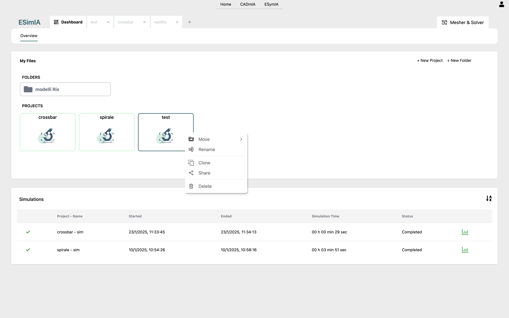
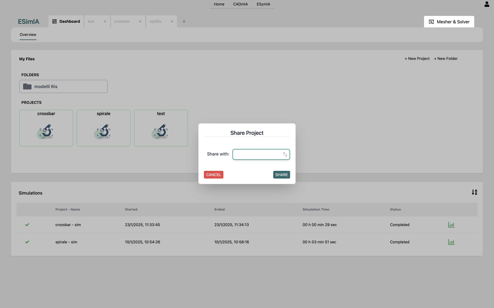

# ESymIA Docs <!-- omit in toc -->

## Versione 0.0.1 <!-- omit in toc -->

- [**Scopo**](#scopo)
- [**Panoramica dell'architettura**](#panoramica-dellarchitettura)
- [**Funzionalità**](#funzionalità)
  - [**Progetti di simulazione**](#progetti-di-simulazione)
    - [**Modeler**](#modeler)
    - [**Terminations**](#terminations)
      - [**Porte**](#porte)
      - [**Frequenze**](#frequenze)
    - [**Simulator**](#simulator)
    - [**Results**](#results)
  - [**Storage utente**](#storage-utente)
    - [**Condivisione progetti e cartelle**](#condivisione-progetti-e-cartelle)

## **Scopo**

ESymIA è un'applicazione per la simulazione delle caratteristiche elettriche/elettroniche di modelli 3D, basandosi su metodologie FEM.

## **Panoramica dell'architettura**

Vediamo innanzitutto uno schema di massima dell'architettura di CADmIA, con esempi di relazioni tra i vari strati per alcune funzionalità specifiche. 
 
L'applicazione è basata su due tecnologie prinicipali lato client:

- *ReactJS*, per lo sviluppo dell'interfaccia;
- *ThreeJS*, per la rappresentazione dei modelli 3D.

Per quanto riguarda la parte server, invece, ne sfrutta essenzialmente tre:

- *Auth0*, per le procedure di autenticazione e gestione degli utenti;
- *Fauna*, per la gestione dei dati dell'app, con le relative politiche di accesso ad essi da parte degli utenti;
- *AWS*, utilizzato come storage per i modelli 3D da importare, che possono arrivare a dimensioni considerevoli, non gestibili direttamente tramite Fauna. 

## **Funzionalità**

ESymIA è tutta incentrata sulla simulazione delle caratteristiche elettriche/elettroniche di modelli 3D. Tutte le sue funzionalità ruotano essenzialmente attorno a questo.
In particolare il flusso di esecuzione di una simulazione si sviluppa in 4 step consecutivi:

- *Modeler*, dove andiamo ad importare il modello da testare;
- *Physics*, nel quale aggiungiamo al modello le informazioni necessarie alla simulazione;
- *Simulator*, nel quale andiamo ad eseguire l'operazione di meshing.
- *Results*, dove visualizzeremo i risultati dei calcoli di simulazione.

Torneremo in dettaglio su ognuno di essi nelle prossime sezioni.

### **Progetti di simulazione**

Il processo di simulazione è interamente racchiuso all'interno di un progetto. Per cui la prima cosa da fare un volta autenticati, sarà quella di aprirne uno. 
Per far questo, a partire dalla dashboard (vedi la figura sottostante), abbiamo due opzioni disponibili:

- creare un nuovo progetto tramite la voce *New Project*: ci verrà chiesto di inserire un nome per esso, oltre ad una descrizione opzionale;
- proseguire con un progetto esistente tra quelli salvati sul database, che possiamo vedere listati nella sezione *My Files*.

Sempre nella dashboard, inoltre, si ha a disposizione la lista delle simulazioni effettuate, dalla quale è possibile andare a visualizzarne direttamente i risultati.

#### **Modeler**

Una volta aperto un progetto, ci ritroveremo automaticamente nella sezione *Modeler*, dalla quale potremo importare, tramite due pulsanti appositi, un modello dal database o da file locale.

Il risultato è visibile nella figura seguente.

In questa sezione, tramite le icone posizionate in alto a sinistra, possiamo vedere dettagli del modello, ovvero i vari elementi che costituiscono la sua struttura interna, e informazioni sui relativi materiali. 
Le informazioni sono a puro scopo documentativo, da ESymIA non è possibile modificare i modelli importati. 
Una volta importato il modello, tramite l'apposita icona, è possibile cambiarlo nel caso in cui è necessario.  
Inoltre, è anche presente la funzionalità di clonazione dell'intero progetto. (Funzionalità disponibile in tutte le sezioni **Modeler**, **Terminations**, **Simulator**, **Results**)  
A questo punto possiamo proseguire nella procedura di simulazione con la sezione successiva.

#### **Terminations**

Una simulazione consiste in sostanza nell'applicazione di correnti o differenze di potenziale in determinati punti del modello e la loro lettura in uscita in altri punti prestabiliti. Dal confronto tra input e output vengono determinate specifiche caratteristiche del modello. 
In questa sezione entriamo nel vivo della simulazione, andando proprio ad impostarne le informazioni di input, definite tramite *porte*, *lumped* e *frequenze*.

##### **Porte**

Le porte, costituite visivamente da coppie di elementi congiunti da una linea, definiscono innanzitutto i punti di applicazione e lettura per le correnti o differenze di potenziale in input alla simulazione. 
Nella figura sottostante possiamo vederne una di esempio. Oltre alle informazioni sulle posizioni di applicazione e lettura, le porte prevedono anche il parametro di Scattering.
I lumped elements, invece, mantengono informazioni specifiche sulle loro caratteristiche interne, rappresentate da un circuito associato e da una tupla di parametri RLC.
Tutte queste informazioni si possono impostare tramite le icone in alto a sinistra nella sezione.  
Per il posizionamento delle porte sul modello, abbiamo 4 alternative:

- Doppio click su un punto d'interesse sulla superficie del modello.
- Abilitanto i suggerimenti sulle posizioni delle terminazioni, cliccando l'apposita icona, e effettuando un doppio click su uno dei suggerimenti proposti.
- Usando i campi di input presenti nella sezione Termination Settings.
- Muovendo i controlli mostrati direttamente sulla porta selezionata (non raccomandato).

___

##### **NOTA** <!-- omit in toc -->

Ricordate di salvare eventuali aggiornamenti alle impostazioni delle porte tramite l'apposito pulsante *SAVE*, altrimenti non verranno considerati.
___

Nell'immagine vediamo anche un menu centrale, dal quale è possibile, da sinistra verso destra:

- selezionare le porte tra due differenti categorie, porte e lumped, ognuna con vincoli interni leggermente differenti, a seconda della specifica simulazione da eseguire;
- abilitare i suggerimenti sul posizionamento delle porte;
- resettare il focus della camera nel canvas;
- mostrare informazioni sul posizionamento delle porte;
- esportare i parametri della simulazione impostati (porte, lumped e frequenze);
- importare le porte da file;
- importare i lumped elements da file;
- imporatre le frequenze da file.

##### **Frequenze**

Le frequenze altro non sono che la rappresentazione matematica delle correnti o differenze di potenziale da applicare in input al modello. 
E' possibile definirle tramite la sezione frequencies come un range di valori spaziati logaritmicamente o linearmente, oppure importandole da file.

#### **Simulator**

Una volta impostate porte e frequenze, possiamo passare alla sezione *Simulator*, nella quale andremo ad eseguire l'operazione di meshing, ovvero una scomposizione del modello in elementi semplici (parallelepipedi nel nostro caso) più piccoli.
I calcoli verranno poi eseguiti in parallelo sui singoli elementi e il risultato finale della simulazione sarà dato da una composizione di tutti i risultati parziali. 
L'applicazione prevede due tipologie di *Mesher*:

- uno che restituisce una scomposizione del modello in elementi semplici tutti della stessa dimensione (*Mesher 1*);
- uno che restituisce una scomposizione del modello in elementi semplici di dimensioni diverse (*Mesher 2*).
Questo perchè sono disponibili due tipi di solver:

- Solver *PEEC-FFT*
- Solver *PEEC-Denso*
per i quali è necessario partire da due input differenrti.  
Il solver *PEEC-FFT* ha bisogno in input di una mesh formata da elementi della stessa dimensione, mentre il solver *PEEC-Denso* necessita in input di una mesh formata da elementi di dimensioni diverse.
A questo punto, è doveroso fare una precisazione. L'utilizzo dei due mesher dipende molto da come è stato costruito, in CADmIA, il modello importato nella sezione *Modeler*. Se il modello è stato realizzato semplicemente attraverso la definizione di una serie di bricks (cubi), allora è possibile generare la mesh sfruttando sia *Mesher 1* che *Mesher 2*. Altrimenti, se il modello è stato costruito a partire da un STL o effettuando operazioni booleane, l'unico mesher utilizzabile è il *Mesher 1*.
Dato che l'utente, dopo la generazione della mesh, può decidere di lanciare la simulazione o di cambiare la mesh, i due mesher prevedono dei parametri di configurazione in input che permettono di aumentare o diminuire il numero di elementi finiti che compongono la mesh.
Per il *Mesher 1* è possibile, tramite gli appositi pulsanti, incrementare o decrementare le dimensioni dei singoli elementi sui tre assi, x, y e z.
Per il *Mesher 2* è possibile settare il paramentro Lambda Factor, aumentandolo verrà generata una mesh con un numero di elementi finiti maggiore, diminuendola verrà generata una mesh con un numero di elementi finiti minore.
Una volta generata la mesh, il solver da lanciare, verrà selezionato automaticamente in base alla tipologia di mesher selezionata.
Di seguito vengono mostrate due immagini che mostrano rispettivamente:

  - la mesh generata grazie al *Mesher 1*;
  - la mesh generata grazie al *Mesher 2*.

La procedura si conclude poi, in ogni caso, con l'avvio della simulazione tramite il pulsante *Start Simulation*.

#### **Results**

Una volta avviata, la simulazione lavorerà in background, per cui nell'attesa potremo anche fare altro. 
Una volta terminata, potremo andare nella sezione *Results* del progetto relativo, per analizzarne i risultati, sottoforma di grafici sulle varie proprietà oggetto di interesse. 
Nell'immagine possiamo vedere una schermata d'esempio di possibili risultati.

Tramite i pulsanti posti nella fascia al di sopra dei grafici è possibile regolare alcune impostazioni di visualizzazione, come la vista su una colonna (grafici più grandi) o su due (più compatta), inoltre è possibile selezionare i gruppi di grafici da visualizzare (All Graph, Z, Y e S) e le porte da osservare.

### **Storage utente**

Per il mantenimento, il recupero e l'organizzazione dei progetti creati dall'utente, viene messo a disposizione un sistema di cloud storage, mediante il quale è possibile:

- organizzare i progetti in cartelle;
- creare, cancellare, modificare e spostare progetti e cartelle;
- condividere progetti e cartelle con gli altri utenti.

Tali funzionalita vengono rese disponibili all’utente attraverso un menù attivabile grazie al click del tasto destro del mouse sul progetto o la cartella a cui si intendono applicare. Per la funzione di spostameto di progetti e cartelle è prevista un’ulteriore modalita di Drag and Drop.

#### **Condivisione progetti e cartelle**

Come già detto, attraverso questo sistema di cloud storage, è possibile anche condividere progetti con gli altri utenti.
Come si vede dalla figura seguente, una volta selezionata l'opzione *Share*, potremo selezionare l'utente con cui condivere, ricercandolo per email. 
Questa funzionalità è disponibile unicamente per gli utenti Premium.

